<!-- 양지호(hhegi) 프로필 README. 로컬 미리보기: node preview/server.mjs -->

<a href="https://github.com/Quick-Pang/Q-Pang" title="올리르바 · Quick-Pang/Q-Pang · 커밋 55회 · 병합 PR 10개"></a>
<a href="https://github.com/Pagely-wisely/meeting-service" title="리그레 · Pagely-wisely/meeting-service · 커밋 22회 · 병합 PR 16개"></a>
<a href="https://github.com/two-fast-delivery/server" title="비비용 · two-fast-delivery/server · 커밋 34회 · 병합 PR 5개"></a>
<a href="https://github.com/hhegi/HTML_CSS_EX" title="레파르다스 · hhegi/HTML_CSS_EX · 커밋 38회 · 병합 PR 0개"></a>
<a href="https://github.com/hhegi/Warrior" title="대굴레오 · hhegi/Warrior · 커밋 7회 · 병합 PR 0개"></a>
<a href="https://github.com/hhegi/code-test" title="오뚝군 · hhegi/code-test · 커밋 9회 · 병합 PR 0개"></a>

<picture>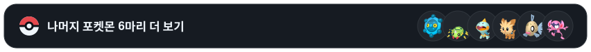</picture>

 

<a href="https://github.com/hhegi/shopping" title="동미러 · hhegi/shopping · 커밋 8회 · 병합 PR 0개"></a>
<a href="https://github.com/hhegi/order-management" title="페이검 · hhegi/order-management · 커밋 4회 · 병합 PR 0개"></a>
<a href="https://github.com/hhegi/openCV_termproject" title="깨물부기 · hhegi/openCV_termproject · 커밋 3회 · 병합 PR 0개"></a>
<a href="https://github.com/hhegi/Campus_App_Tour" title="요테리 · hhegi/Campus_App_Tour · 커밋 2회 · 병합 PR 0개"></a>
<a href="https://github.com/hhegi/cinamon" title="빈티나 · hhegi/cinamon · 커밋 4회 · 병합 PR 0개"></a>

<a href="https://wantaekchoi.github.io/pokerepo/?u=hhegi">hhegi's Dex</a> · powered by <a href="https://github.com/wantaekchoi/pokerepo">PokeRepo</a>

